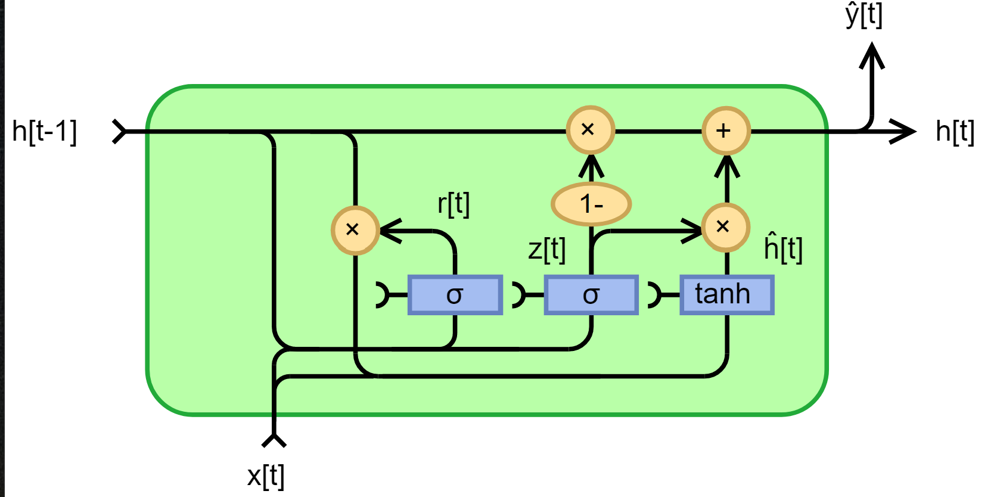
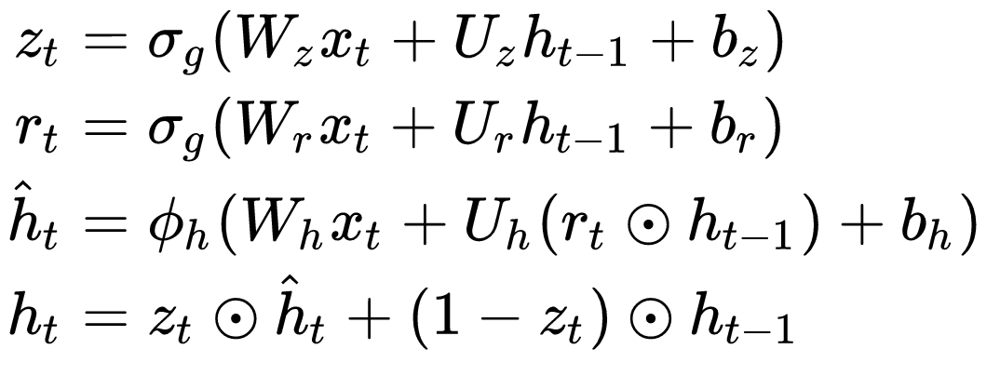
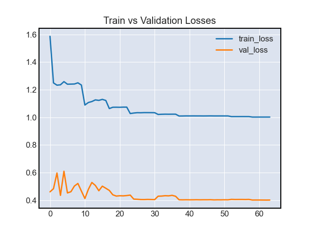
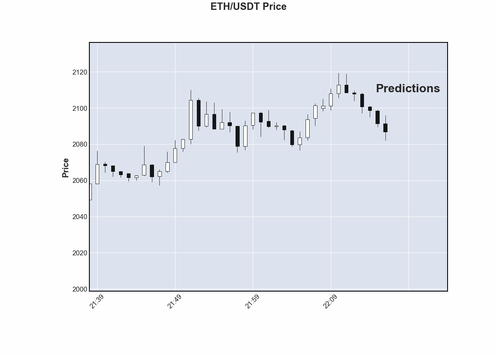

# GRU-ow
Gated Recurrent Network (GRU) to GRUow your savings

## Overview
  * [Intro](#intro)
  * [Requirements](#requirements)
  * [Usage](#usage)
  * [Results](#results)
  * [Dex Swap](#dexswap)
  * [References](#references)


### Intro
Recent years have seen remarkable progress in the development of statistical and machine learning methods, largely driven by work in the field of deep neural networks. Increasingly, developer/datascience time spent feature engineering is being replaced by compute cycles and growing data ingestion pipelines. Performance on sequence modeling tasks has improved dramatically with the introduction of novel deep neural netowrks designs such as Long-Short Term Memory (LSTM), Gated Recurrent Unit (GRU), and Attention based Transformer Networks. These models represent some of the most powerful dynamic memory autoregressive techniques, a quality essential in attempts to model the complex nonstationary (constantly changing) dynamics of asset exchange markets, such as that of ETH/USDC. In this repo we implement a simple single-hidden layer Gated Recurrent Network trained to forecast minute level price candles (OHLC), 8 minutes into the future, with the input of the most recent 128 minute candle+volume (OHLCV). Applications of this type of model extend to **volatitlity modeling for risk-management**, price impact of **trade execution optimization**, and model-based reinforcement learning **optimal portfolio construction**.


#### Architecture
The architectural design of the GRU circuit is illustrated below. Each GRU is a node in a deep neueral netowkr that is designed with learnable weight parameters that determine the rate/level of information propogation across a sequence of observed isntances. These units effectively gate the memory of our neural netowrk. They are a condensed and more efficient implementation of the original LSTM gated memory model.



Below is the GRU circuit's math, i.e. the above circuit in the form of math equations whose parameters we will train to estimate




### Requirements
  * Linux distributions that use glibc >= v2.17
  * gnache-cli >= 6.12.2
  * Python 3.6
  * matplotlib == 3.1.1
  * numpy == 1.19.4
  * pandas == 0.25.1
  * scikit_learn == 0.21.3
  * torch == 1.8.0
  * mplfinance == 0.12.9b0
  * scipy == 1.7.3
  * eth-brownie == 1.18.2


Python pakcage dependencies can be installed using the following command:
```
pip install -r requirements.txt
```
Optional - For training on a GPU (highly recommended), Nvidia CUDA 10.0+ drivers are required

### Usage

Input data is ETH-USDC OHLCV

```
closing_price,date,highest_price,lowest_price,open_price,volume
```

In the command line run to launch an interactive python session with a model that will train on an nvidia gpu if one is available and CUDA is installed, or the CPU if no compatble GPU is found.

```python
python -i model/train_model.py
```

Model convergece observed in our training, as indicated be declining and then plateauing training and validation losses. Even with such a small and limited implementation of this model we get aplha generating results




### Results

Using our model to predict prices from our last observed data point. Projecting prices 8 minutes into the future. This is a tunable hyperparamter btw, can project further into the future, but at the expense of training time and model accurracy. 





### DexSwap

dex_swap contains a simple python Brownie script for on-chain conversion of ETH => WETH and then swapped for USDC on uniswap v3


### References

[GRU paper](https://arxiv.org/pdf/1412.3555.pdf)

[GRU applications](https://arxiv.org/pdf/1906.01005.pdf)
